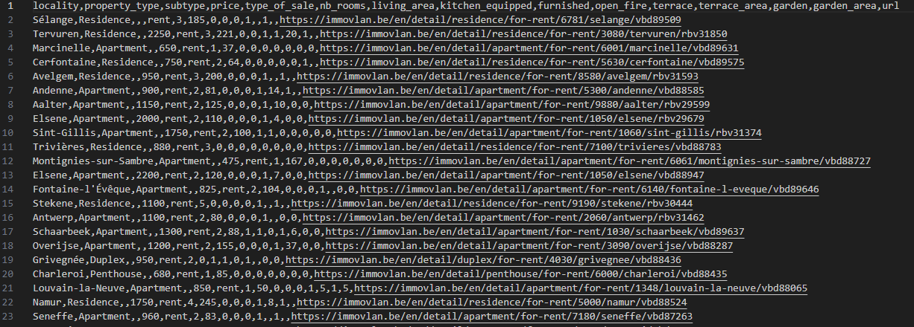

ImmoEliza Web Scraper 

A high-performance web scraping project built with **Python** and **Scrapy** to collect 10,000+ real estate listings from [Immovlan.be](https://immovlan.be). This data is intended for market analysis and price prediction models.

**Features**
- **Large-scale extraction:** Designed to handle 10,000+ pages using Scrapy's asynchronous engine.
- **Data Points:** Extracts 18+ variables including locality, price, property type, rooms, area, and garden/terrace specifics.
- **Anti-Bot Bypass:** Implements custom User-Agents and request headers to avoid HTTP 403 errors.
- **Automated Pagination:** Automatically discovers and follows "Next Page" links to crawl the entire database.

**Requirements**
- **Language:** Python 3.13
- **Framework:** [Scrapy](https://scrapy.org)
- **Data Processing:** [Pandas](https://pandas.pydata.org) (for cleaning `results.csv`)

**Extracted Attributes**

  Locality: City or postal code of the property
  Price:Sale or rent price in Euro
  Type: House, Apartment, Studio, etc. 
  Living Area: Total square meters (m²)
  Amenities | Terrace (Area), Garden (Area), Swimming Pool, etc. 

**Installation & Usage**

1. **Clone the repository:**
   ```bash
   git clone https://github.com[/jobs.naik23/immo_eliza_scraping.git
   cd immo_eliza_scraping
2. **Set up Virtual Environment:**
   ```bash
   python -m venv venv
   venv\Scripts\activate
3. **Install Dependencies:**
   ```bash
   pip install scrapy
   pip install pandas
4. **Run the Spider:**
   ```
   scrapy crawl immo_eliza -o result.csv
5. **Output in result.csv file**
